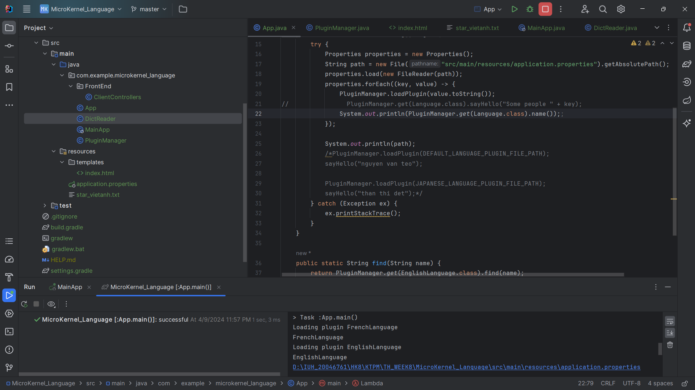
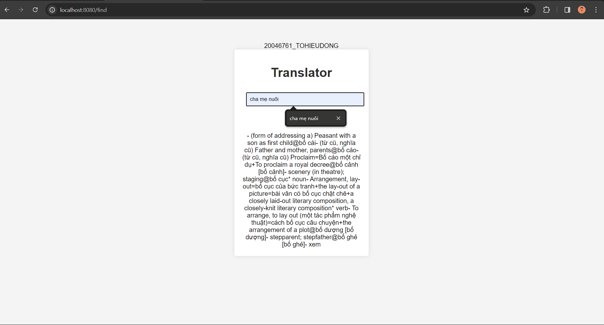

# KTPM_WEEK8
Bài tập tuần 8
[Localhost](http://localhost:8080)

## Yếu cầu:
Dựa trên kiến trúc microkernel, hãy tạo một kernel cho một từ điển gồm một phương thức tra từ, giao diện bao gồm một textbox cho việc nhập từ cần tra, một listbox cho danh sách từ khả dĩ, một textfield khác cho việc hiển thị thông tin tra được của từ cần tra.
Các plug-ins trong từ điển này là các từ điển với nội dung từ có thể tham khảo từ dự án “Open Vietnamese Dictionary Project Files”
Khi plug-in một từ điển vào, một menu sẽ được thêm vào giao diện cho phép chọn ngôn ngữ cần tra.
*** Các yêu cầu khác tự thêm vào để hoàn thiện dự án.

Chú ý: Sử dụng cấu trúc Map<K,V> để tra từ.

- 
- 
